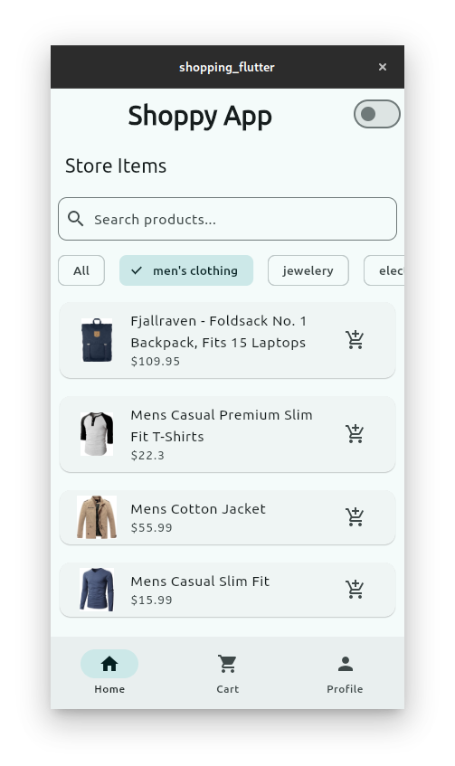
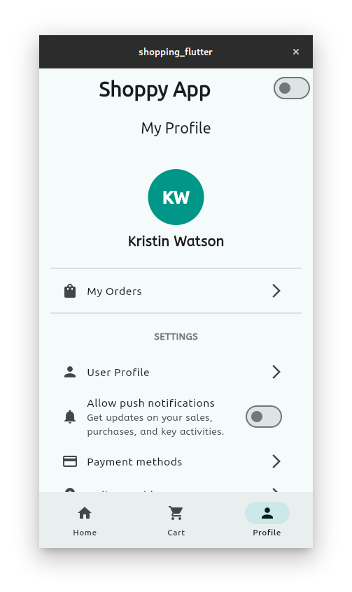

# Shopping App with Flutter


A simple and elegant shopping app built with Flutter. This app demonstrates the use of Flutter's powerful UI toolkit to create a seamless shopping experience. The app includes features like product browsing, adding items to a cart, and a smooth checkout process.

## Features

- **Product Catalog**: Browse through a list of products with details such as name, price, and image.
- **Shopping Cart**: Add and remove products from the cart.
- **Responsive UI**: A clean and responsive user interface that works on both mobile and tablet devices.
- **State Management**: Efficient state management using Provider or Riverpod (depending on the implementation).
- **Dark Mode Support**: Optional dark theme for better user experience in low-light conditions.

## Screenshots





## Getting Started

### Prerequisites

- Flutter SDK: Make sure you have Flutter installed on your machine. If not, follow the [official installation guide](https://flutter.dev/docs/get-started/install).
- Dart: Flutter uses Dart as its programming language. Ensure you have Dart installed alongside Flutter.

### Installation

1. **Clone the repository**:
   ```bash
   git clone https://github.com/AaronPeterOcen/shopping_flutter.git

2. **Navigate to the project directory**:
    ```bash
    cd shopping_flutter


3. **Install dependencies**:
    ```bash
    flutter pub get

4. ***Run the app***:
    ```bash
    flutter run

### Running Tests
- To run unit tests and widget tests, use the following command:

    ```bash
    flutter test

- For integration tests:
    ```bash
    flutter drive --target=test_driver/app.dart

## Dependencies

This project uses the following key dependencies:

- **Provider**: For state management.
- **http**: For making API requests (if applicable).
- **fluttertoast**: For displaying toast messages.
- **cached_network_image**: For efficient image loading.

To see the full list of dependencies, check the `pubspec.yaml` file.

## Contributing

Contributions are welcome! If you'd like to contribute, please follow these steps:

1. Fork the repository.
2. Create a new branch (`git checkout -b feature/YourFeatureName`).
3. Commit your changes (`git commit -m 'Add some feature'`).
4. Push to the branch (`git push origin feature/YourFeatureName`).
5. Open a pull request.

Please ensure your code follows the project's coding standards and includes appropriate tests.

## License

This project is licensed under the MIT License. See the [LICENSE](LICENSE) file for details.

## Acknowledgments

- [Flutter Documentation](https://flutter.dev/docs) for providing excellent resources.
- [Unsplash](https://unsplash.com/) for free images used in the app.