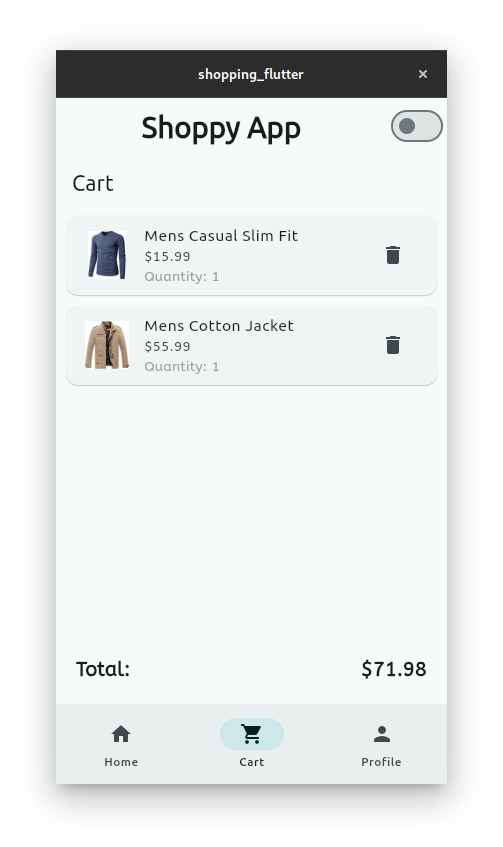

# Shopping App with Flutter


A simple and elegant shopping app built with Flutter. This app demonstrates the use of Flutter's powerful UI toolkit to create a seamless shopping experience. The app includes features like product browsing, adding items to a cart, and a smooth checkout process.

## Features

- **Product Catalog**: Browse through a list of products with details such as name, price, and image.
- **Shopping Cart**: Add and remove products from the cart.
- **Responsive UI**: A clean and responsive user interface that works on both mobile and tablet devices.
- **State Management**: Efficient state management using Provider or Riverpod (depending on the implementation).
- **Dark Mode Support**: Optional dark theme for better user experience in low-light conditions.

## Screenshots





## Getting Started

### Prerequisites

- Flutter SDK: Make sure you have Flutter installed on your machine. If not, follow the [official installation guide](https://flutter.dev/docs/get-started/install).
- Dart: Flutter uses Dart as its programming language. Ensure you have Dart installed alongside Flutter.

### Installation

1. **Clone the repository**:
   ```bash
   git clone https://github.com/AaronPeterOcen/shopping_flutter.git

2. **Navigate to the project directory**:
    ```bash
    cd shopping_flutter


3. **Install dependencies**:
    ```bash
    flutter pub get

4. ***Run the app***:
    ```bash
    flutter run